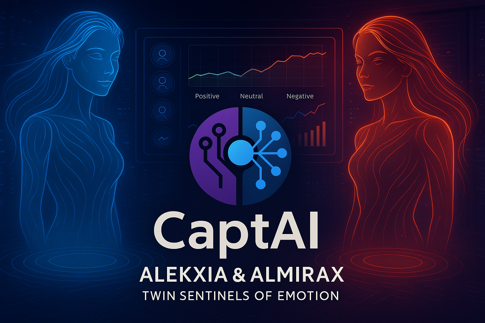

# 🎭 CaptAI™

**CaptAI™** is an intelligent sentiment analysis system powered by **dual machine learning models** trained on a **50,000-review IMDb dataset**.  
It enables users to automatically analyze audience sentiment in movie reviews, classifying them as **Positive** or **Negative** with high confidence and interpretability.

---

## 🚀 Key Features

- Dual sentiment analysis models:
  - **Model Alekxia**
  - **Model Almirax**
- Adjustable prediction confidence threshold
- Keyword-based sentiment explanation
- Confidence score for each prediction
- Automatic word cloud visualization
- Clean and interactive Streamlit interface

---

## 🧠 Use Case

CaptAI is designed for:
- Movie review sentiment analysis
- Audience opinion mining
- NLP demonstrations and research
- Educational and portfolio showcase purposes

---

## 🛠️ How to Use CaptAI

1. **Launch the application**
2. Select your preferred sentiment analysis model from the sidebar:
   - *Model Alekxia* or *Model Almirax*
3. (Optional) Adjust the prediction confidence threshold
4. Enter a movie review text (maximum of **200 words**)
5. Click **Analyze Sentiment**
6. View the results:
   - Predicted sentiment (*Positive* or *Negative*)
   - Model confidence score
   - Summary of influential keywords
   - Word cloud of dominant terms

---

## 📊 Output Explanation

The system provides:
- **Predicted Sentiment:** Final classification result
- **Confidence Score:** Model certainty for the prediction
- **Keyword Summary:** Words influencing the decision
- **Word Cloud:** Visual representation of prominent terms

---

  

---

## 🔗 Live Demo

👉 **[Try the Live App Here](https://captai.streamlit.app/)**

---

## 🧩 Technologies Used

- Python
- Scikit-learn
- Natural Language Processing (NLP)
- Streamlit
- IMDb Movie Reviews Dataset

---

## 👤 Author

**Abdul-Azeez Olohunjuwon**  
AI/ML & LLM Developer | Research Writer
